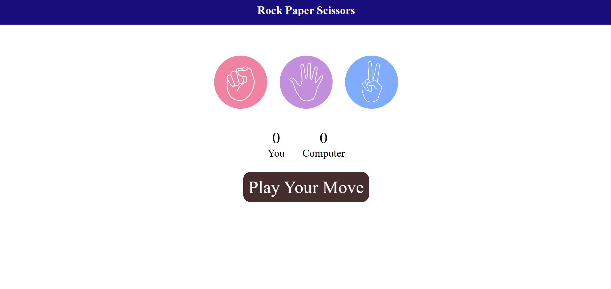

# 🪨📄✂️ Stone Paper Scissors Game

A simple **Rock-Paper-Scissors** game built with **HTML, CSS, and JavaScript**.  
This version includes a **counter** to keep track of how many times the user or computer has won!

---

## 🚀 Features

- Interactive UI for selecting rock, paper, or scissors
- Random computer choice generation
- Result display: **Win / Lose / Tie**
- **Score counter** for both user and computer
- Clean and beginner-friendly JavaScript code

---

## 📸 Screenshot

---

## 🛠️ How It Works

- You click on one of the choices: Rock, Paper, or Scissors.
- The computer randomly selects a choice.
- The winner is determined using classic RPS rules:
  - Rock beats Scissors
  - Paper beats Rock
  - Scissors beats Paper
- Winner scores are updated live on the screen.

---

## 🔧 Tech Stack

- HTML
- CSS
- JavaScript (Vanilla)

---

## 📄 License

This project is open-source and free to use.

---

💡 _Built for fun and learning!_

